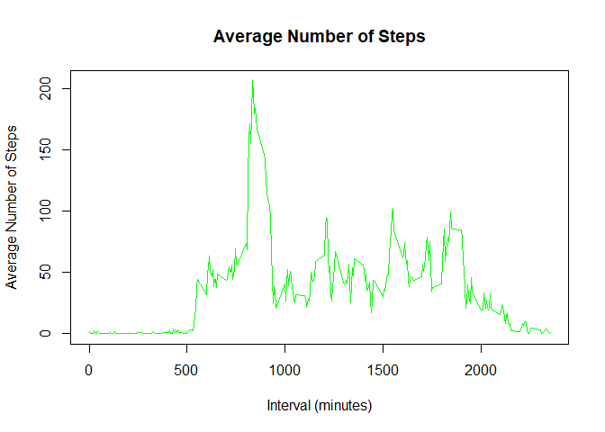
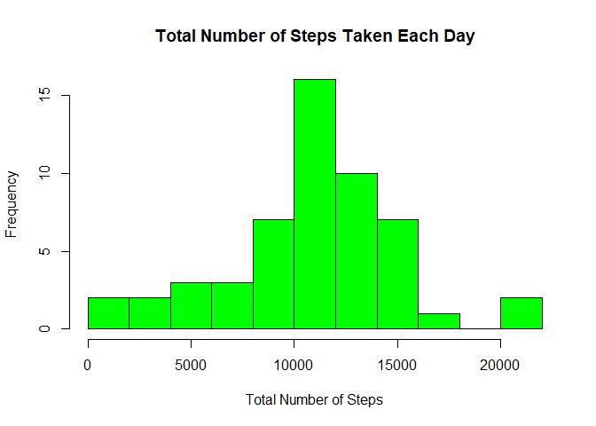

This Assignment provides a detailed HTML formatted file produced using R Markdown. The data is collected from personal activity monitering device such as Fitbit *etc*. from an anaymous person.The data is collected at 5 minute intervals from the period between October and November 2012.  

The three variables are:  
- Steps: The number of steps taken in the 5 minute intervals.  
- Date: The particlur date the measurements were taken (YYYY-MM-DD).  
- interval: The 5 minute interval (in minutes)  
- Missing values are represented by NA  

The data is stores as a CSV file and there are 17,568 observations per column.  

## Loading and preprocessing the data

Initially the data is downloaded as a zip file and put in the working directory. The data is then unzipped and the activity.csv file containing the data is read.


```r
if(!file.exists("Assignemnt")){dir.create("Assignment")}
```

```
## Warning in dir.create("Assignment"): 'Assignment' already exists
```

```r
fileUrl <- "https://d396qusza40orc.cloudfront.net/repdata%2Fdata%2Factivity.zip"
destFile <- "./Assignment/activity.zip"
download.file(fileUrl, 
              destFile)
unzip(destFile, exdir = "./Assignment")
activityData <- read.csv("./Assignment/activity.csv", 
                         header = TRUE, 
                         sep = ",")
```

Finally, the date is transformed into the class of "Date"


```r
class(activityData$date)
```

```
## [1] "factor"
```


```r
activityData$date <- as.Date(activityData$date, 
                             format="%Y-%m-%d")
class(activityData$date)
```

```
## [1] "Date"
```

## What is mean total number of steps taken per day?
### Total number of steps taken each day.

Initially, the total number of steps taken each day is calculated.


```r
totalNumber <- as.data.frame(lapply(split(activityData$steps, 
                                          activityData$date), 
                                    sum))
totalNumber <- t(totalNumber)
totalNumber2 <-data.frame(unique(activityData$date), 
                          totalNumber)
rownames(totalNumber2) <- c()
colnames(totalNumber2) <- c("Date", "Total Number")
totalNumber2[complete.cases(totalNumber2), ]
```

```
##          Date Total Number
## 2  2012-10-02          126
## 3  2012-10-03        11352
## 4  2012-10-04        12116
## 5  2012-10-05        13294
## 6  2012-10-06        15420
## 7  2012-10-07        11015
## 9  2012-10-09        12811
## 10 2012-10-10         9900
## 11 2012-10-11        10304
## 12 2012-10-12        17382
## 13 2012-10-13        12426
## 14 2012-10-14        15098
## 15 2012-10-15        10139
## 16 2012-10-16        15084
## 17 2012-10-17        13452
## 18 2012-10-18        10056
## 19 2012-10-19        11829
## 20 2012-10-20        10395
## 21 2012-10-21         8821
## 22 2012-10-22        13460
## 23 2012-10-23         8918
## 24 2012-10-24         8355
## 25 2012-10-25         2492
## 26 2012-10-26         6778
## 27 2012-10-27        10119
## 28 2012-10-28        11458
## 29 2012-10-29         5018
## 30 2012-10-30         9819
## 31 2012-10-31        15414
## 33 2012-11-02        10600
## 34 2012-11-03        10571
## 36 2012-11-05        10439
## 37 2012-11-06         8334
## 38 2012-11-07        12883
## 39 2012-11-08         3219
## 42 2012-11-11        12608
## 43 2012-11-12        10765
## 44 2012-11-13         7336
## 46 2012-11-15           41
## 47 2012-11-16         5441
## 48 2012-11-17        14339
## 49 2012-11-18        15110
## 50 2012-11-19         8841
## 51 2012-11-20         4472
## 52 2012-11-21        12787
## 53 2012-11-22        20427
## 54 2012-11-23        21194
## 55 2012-11-24        14478
## 56 2012-11-25        11834
## 57 2012-11-26        11162
## 58 2012-11-27        13646
## 59 2012-11-28        10183
## 60 2012-11-29         7047
```

I think some of the days the gadget must have been switched off ;)

### Histagram of the total number of steps taken each day


```r
hist(totalNumber2$`Total Number`, 
     breaks = 10, 
     col = "green", 
     main = "Total Number of Steps Taken Each Day", 
     xlab = "Total Number of Steps")
```

<!-- -->

### The Mean and Median number of steps taken each day.

The mean and median number of steps taken each day are as follows.


```r
Mean <- mean(totalNumber, 
             na.rm = TRUE)
Median <- median(totalNumber, 
                 na.rm = TRUE)
cat("The mean is", Mean, "and the median is", Median)
```

```
## The mean is 10766.19 and the median is 10765
```

## What is the average daily activity pattern?

The average number of steps per 5 minute interval over the 2 months was taken. 


```r
activityData2 <- activityData[complete.cases(activityData$steps),]
mean1 <- aggregate(steps ~ interval, 
                   activityData2, 
                   mean)
plot(mean1$interval, 
     mean1$steps, 
     type = "l", 
     main = "Average Number of Steps", 
     xlab = "Interval (minutes)",
     ylab = "Average Number of Steps",
     col = "green")
```

<!-- -->

The 5 minute Interval containing the highest average number of steps was calculated bu the following.


```r
mean1[which.max(mean1$steps),]
```

```
##     interval    steps
## 104      835 206.1698
```

## Imputing missing values

The amount of missing values is calculated a follows:


```r
sum(is.na(activityData$steps))
```

```
## [1] 2304
```

The account for missing valaues, numbers were inserted based on the average for that 5 minute interval. As such a new data set was created containing these values.


```r
imputedAcData <- activityData
for (i in 1:nrow(imputedAcData)) {
  if (is.na(imputedAcData$steps[i])) {
    interval_value <- imputedAcData$interval[i]
    steps_value <- mean1[
    mean1$interval == interval_value,]
    imputedAcData$steps[i] <- steps_value$steps
  }
}
```

Similar to before, a histogram, the mean and median were calculated.


```r
totalNumber3 <- as.data.frame(lapply(split(imputedAcData$steps, 
                                           imputedAcData$date), 
                                     sum))
totalNumber3 <- t(totalNumber3)
totalNumber4 <-data.frame(unique(imputedAcData$date), 
                          totalNumber)
rownames(totalNumber4) <- c()
colnames(totalNumber4) <- c("Date", "Total Number")
head(totalNumber4[complete.cases(totalNumber4), ])
```

```
##         Date Total Number
## 2 2012-10-02          126
## 3 2012-10-03        11352
## 4 2012-10-04        12116
## 5 2012-10-05        13294
## 6 2012-10-06        15420
## 7 2012-10-07        11015
```

```r
hist(totalNumber4$`Total Number`, 
     breaks = 10, 
     col = "green", 
     main = "Total Number of Steps Taken Each Day",
     xlab = "Total Number of Steps")
```

<!-- -->

```r
Mean2 <- mean(totalNumber3, 
             na.rm = TRUE)
Median2 <- median(totalNumber3, 
                 na.rm = TRUE)
cat("The mean is", Mean2, "and the median is", Median2, ". Comparing this to the mean (", Mean, ") and the median (" ,Median, ") of the sample containing the missing values, there is not much difference." )
```

```
## The mean is 10766.19 and the median is 10766.19 . Comparing this to the mean ( 10766.19 ) and the median ( 10765 ) of the sample containing the missing values, there is not much difference.
```

## Are there differences in activity patterns between weekdays and weekends?
